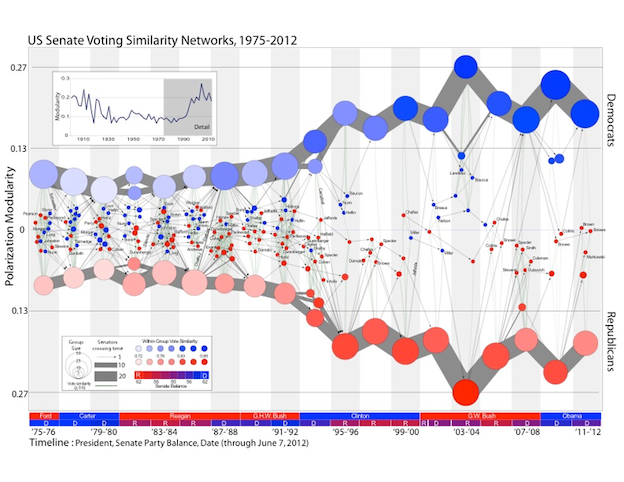

class: center, top
```{r setup, include=FALSE}
options(htmltools.dir.version = FALSE,
        htmltools.preserve.raw = FALSE)
knitr::opts_chunk$set(fig.retina = 3, warning = FALSE, message = FALSE)

```

```{r load_packages, include = FALSE}
#install.packages("igraph")
#install.packages("igraphdata")
#install.packages("ape")
library(igraphdata)
library(igraph)

```

``` {r, include = FALSE}

#default margins
def_marg <- c(5.1, 4.1, 4.1, 2.1)

#no margins
no_marg <- c(0, 0, 0, 0)

```

# Antes de empezar...

Asegúrate de descargar los materiales del taller:

https://github.com/mcramosf/intro_sna_LatinR 

---
class: left, top

# Antes de empezar...

Asegúrate de descargar los paquetes que necesitamos:
<br>

**igraph** para analizar redes
```{r, eval = FALSE}
install.packages("igraph")
```


**igraphdata** para obtener datos
```{r, eval= FALSE}
install.packages("igraphdata")
```

---
class: chapter-slide

.center[# Primera gráfica]

.center[## ¡Hora de escribir código!]
---
class: left, top

# Nuestra primera gráfica de redes 
.center[
```{r, echo= FALSE}
library(igraph)
library(igraphdata)
data(karate)
l <- layout_nicely(karate)
plot(karate, 
     vertex.color = "#4c4ef4",
     vertex.frame.color = "#4c4ef4",
     vertex.size = 15,
     vertex.shape = "circle",
     vertex.label.cex = 1,
     vertex.label.color = "white",
     vertex.label.family = "Helvetica",
     edge.color = "black", 
     layout = l)

```
]

---
class: center, middle

# Elementos de una red

---
class: left, top

# Elementos de una red 

- Vértices o nodos<br>
  *(vertices or nodes)*
.center[
```{r, echo = FALSE}
plot(karate,
     vertex.color = "#4c4ef4",
     vertex.label.color = "white", 
     vertex.label.family = "Helvetica",
     vertex.frame.color = "black",
     vertex.label.cex= 1, 
     edge.size = 1, 
     layout = l)
```
]
---
class: left, top

# Elementos de una red 

- Vínculos o conexiones<br>
  *(edges or ties)* 

.center[
```{r, echo = FALSE}
plot(karate,
     vertex.color = "white",
     vertex.label.color = "black", 
     vertex.label.family = "Helvetica",
     vertex.frame.color = "black",
     vertex.label.cex= 1,
     edge.color = "#4c4ef4",
     edge.width = 2,
     layout = l)
```
]

---
class: left, top

# Red

El conjunto de vértices y sus relaciones.

.center[
```{r, echo = FALSE}
plot(karate,
     vertex.color = "gray",
     vertex.label.color = "black", 
     vertex.label.family = "Helvetica",
     vertex.frame.color = "black",
     vertex.label.cex= 1,
     edge.color = "black", 
     layout = l)
```
]

--- 
class: left, top

# Ejemplos de vértices y vínculos

---
class: center, middle

# Atributos

---
class: left, top

# Atributos de los vértices


---
class: left, top

# Atributos de los vínculos

## 1. Dirección

.pull-left[
- Vínculos dirigidos<br>
*(directed edges)*
```{r, echo = FALSE}

g <- graph_from_literal( A +-+ B --+ C +-- D,E --+ G, C +-- G, C --+E, M+--H)

l2 <- layout_with_fr(g)
plot(g,
     vertex.size = 20,
     vertex.color = "white",
     vertex.label.color = "black", 
     vertex.label.family = "Helvetica",
     vertex.frame.color = "black",
     vertex.label.cex= 2.5,
     edge.color = "#4c4ef4", 
     edge.width = 5, 
     edge.arrow.size = 2, 
     edge.curved = 0.5,
     layout = l2)
```
]

.pull-right[
- Vínculos no dirigidos<br>
*(undirected edges)*
```{r, echo = FALSE}
g1 <- as.undirected(g)
plot(g1,
     vertex.size = 20,
     vertex.color = "white",
     vertex.label.color = "black", 
     vertex.label.family = "Helvetica",
     vertex.frame.color = "black",
     vertex.label.cex= 2.5,
     edge.color = "#4c4ef4", 
     edge.width = 5,
     layout = l2)
```
]

---
class: left, top

# Atributos de los vínculos

## 2. Pesos o ponderaciones

.pull-left[
- Vínculos sin peso <br>
*(unweighted edges)*
```{r, echo = FALSE}
plot(g1,
     vertex.size = 20,
     vertex.color = "white",
     vertex.label.color = "black", 
     vertex.label.family = "Helvetica",
     vertex.frame.color = "black",
     vertex.label.cex= 2.5,
     edge.color = "#4c4ef4", 
     edge.width = 5,
     layout = l2)
```
]

.pull-right[
- Vínculos con peso<br>
*(weighted edges)*
```{r, echo = FALSE}
E(g1)$weight <- c(1,2,5,4,6,7,3)

plot(g1,
     vertex.size = 20,
     vertex.color = "white",
     vertex.label.color = "black", 
     vertex.label.family = "Helvetica",
     vertex.frame.color = "black",
     vertex.label.cex= 2.5,
     edge.color = "#4c4ef4", 
     edge.width = E(g1)$weight,
     edge.label = E(g1)$weight,
     edge.label.color = "black",
     edge.label.cex = 2.5,
     edge.label.family = "Helvetica",
     layout = l2)
```
]

---
class: chapter-slide

.center[# Inspección de redes]

.center[## ¡Hora de escribir código!]

---
class: left, top

# Características generales de la red

.left[
+ Tamaño de red<br>
(número de vértices)
+ Número de vínculos
+ Tipo de red 
  - dirigida o no dirigida
  - ponderada o no ponderada
+ Atributos
  - de la red 
  - de los vértices
  - de los vínculos
]

---
class: center, top

# ¡Tu turno!

Carga y explora la red de profesores en una universidad de Inglaterra.

.left[
1. ¿Cuántos vértices tiene la red?
2. ¿Cuántos vínculos tiene la red?
3. ¿La red es dirigida o no dirigida? 
4. ¿Cuál es el rango de los pesos de vínculos? 
]

```{r, echo = FALSE}
library(countdown)
countdown(minutes = 3, 
          seconds = 00,
          color_text= "#4c4ef4",
          color_running_background  = "#4c4ef4",
          color_border = "#4c4ef4", 
          color_running_border = "#4c4ef4",
          box_shadow = NULL,
          color_running_text = "#4c4ef4",
          color_finished_background = "#4c4ef4",
          color_finished_text = "#4c4ef4",
          left = 0,  right = 0,
          padding = "60px",
          margin = "0%",
          font_size = "5em")
```

---
#Soluciones

```{r, highlight.output = 1}
data("UKfaculty")
UKfaculty
```

```{r, highlight.output = 2}
summary(E(UKfaculty)$weight)
```
---
class: center, middle

# Visualización de redes

---
# Dos métodos

.pull-left[Opción 1: Establecer las propiedades visuales fuera de la función `plot()`

1. Configurar los atributos de los vértices y/o vínculos en el objeto de tipo red

2. Graficar la red

```{r, eval = FALSE}
# 1: crear/transformar el atributo 
V(karate)$color <- "dodgerblue"

# 2: graficar la red
plot(karate)
```
]

.pull-right[Opción 2: Establecer las propiedades visuales dentro de la función `plot()`

1. Utiliza los argumentos de la función

```{r, eval=FALSE}
# 1: utilizar el argumento

plot(karate,
     vertex.color = "dodgerblue")
```

]
---
class: left, top

# Parámetros de visualización: vértices

vertex.[parámetro] =<br>
(e.g., vertex.color =)

```{r, echo=FALSE}
dfn <- data.frame(param_name = c("color", 
                               "shape",
                               "size", 
                               "label", 
                               "label.family",
                               "label.font",
                               "label.cex", 
                               "label.dist", 
                               ""), 
                  meaning = c("color", 
                              "forma", 
                              "tamaño",
                              "etiqueta", 
                              "fuente de etiqueta", 
                              "opciones de fuente", 
                              "tamaño de fuente", 
                              "distancia de etiqueta", ""),
                  purpose_options =c("color del vértice", "círculo, cuadrado, rectángulo, esfera, etc.", 
                                    "predeterminado = 15", "-", "Helvetica, Times", "1= simple, 2= negrita, 3= cursiva, 4 = cursiva y negrita", "-", "distancia entre la etiqueta y el vértice", ""))
dfn %>%
   knitr::kable(format = "html", 
                col.names = c("argumento", 
                              "significado", 
                              "propósito u opciones"))
```

---
# Parámetros de visualización: vínculos

edge.[parámetro] = <br>
(e.g., edge.color =)

```{r, echo=FALSE}
dfe <- data.frame(edge_parameter = c("lty",
                               "width", 
                               "arrow.width",
                               "arrow.size",
                               "arrow.mode", 
                               "curved"),
                  meaning = c("tipo de línea", 
                              "ancho de línea",
                              "ancho de flecha", 
                              "tamaño de flecha", 
                              "dirección de flecha", 
                              "curvatura"),
                  purpose_options =c("1 = sólida, 2 = discontinua, 3 = punteada, 4 = punto y línea, etc.","predeterminado = 1", "predeterminado = 1", "predeterminado = 1", "0 = sin flecha, 1 = inversa, 2 = hacia adelante, 3 = bidireccional", "rango [0,1]"))

dfe %>%
   knitr::kable(format = "html", 
                col.names = c("argumento", "significado", "propósito u opciones"))

```
---
class: chapter-slide

.center[# Visualización de redes]

.center[## ¡Hora de escribir código!]

---
class: left, top

# Paleta de igraph
.center[
```{r, echo=FALSE}
x = 1:8
y = rep(1,8)
plot(x,y, pch=20, cex=20, col=categorical_pal(8), 
     xlim=c(0.5,8.5), 
     xlab = NA, 
     ylab = NA, 
     axes = FALSE)
```
]
---
class: inverse, center, top

# ¡Tu turno!

Configura las propiedades de visualización de la red del club de karate.

.left[
1. Utiliza la hoja de repaso de visualización para que los vínculos sean del color de tu elección. 
2. ¿Qué fragmento del siguiente código hace que las etiquetas desaparezcan?
3. Cambia la gráfica para que el ancho de los vínculos sea igual al atributo “weight” o peso de los vínculos.  
4. Cambia el código para que los vínculos sean representados por líneas punteadas. 
]

```{r, echo = FALSE}
library(countdown)
countdown(minutes = 3, 
          seconds = 00,
          color_text= "#4c4ef4",
          color_running_background  = "#4c4ef4",
          color_border = "#4c4ef4", 
          color_running_border = "#4c4ef4",
          box_shadow = NULL,
          color_running_text = "#4c4ef4",
          color_finished_background = "#4c4ef4",
          color_finished_text = "#4c4ef4",
          left = 0,  right = 0,
          padding = "60px",
          margin = "0%",
          font_size = "5em")
```

---
class: center, middle

# Soluciones

---

class: center, middle

# Métricas globales

---
class: left, top

# Densidad

.center[Número de vínculos que observamos en la red sobre el número de vínculos posibles.]

```{r}
graph.density(karate)
```

---
class: left, top

# Transitividad global

Número de tríadas transitivas sobre el total de tríadas.

.pull-left[
**Tríada transitiva**
```{r, echo = FALSE}
g2 <- graph_from_literal( A --- B --- C ---A)

l3 <- layout_with_fr(g2)
plot(g2,
     vertex.size = 20,
     vertex.color = "white",
     vertex.label.color = "black", 
     vertex.label.family = "Helvetica",
     vertex.frame.color = "black",
     vertex.label.cex= 2.5,
     edge.color = "#4c4ef4", 
     edge.width = 5, 
     edge.arrow.size = 2,
     layout = l3)

```
]

.pull-right[
**Tríada no transitiva**
```{r, echo = FALSE}
g3 <- graph_from_literal( A --- B --- C)

plot(g3,
     vertex.size = 20,
     vertex.color = "white",
     vertex.label.color = "black", 
     vertex.label.family = "Helvetica",
     vertex.frame.color = "black",
     vertex.label.cex= 2.5,
     edge.color = "#4c4ef4", 
     edge.width = 5, 
     edge.arrow.size = 2,
     layout = l3)

```
]

---
class: left, top

# Transitividad global

Número de tríadas transitivas sobre el total de tríadas.

```{r}
transitivity(karate, type = "global")
```

---
class: inverse, center, top

#¡Tu turno!


Explora métricas globales en la red de profesores en una universidad de Inglaterra.

.left[
1. Calcula la densidad y transitividad de la red de profesores en Inglaterra.
2. Compara la densidad y transitividad en la red del club de karate con las métricas obtenidas en la red de profesores.
]

 
```{r, echo = FALSE}
library(countdown)
countdown(minutes = 3, 
          seconds = 00,
          color_text= "#4c4ef4",
          color_running_background  = "#4c4ef4",
          color_border = "#4c4ef4", 
          color_running_border = "#4c4ef4",
          box_shadow = NULL,
          color_running_text = "#4c4ef4",
          color_finished_background = "#4c4ef4",
          color_finished_text = "#4c4ef4",
          left = 0,  right = 0,
          padding = "60px",
          margin = "0%",
          font_size = "5em")
```

---
class: left, top

# Soluciones

Densidad

```{r}
graph.density(UKfaculty)
```

Transitividad

```{r}
transitivity(UKfaculty, type = "global")
```

---
class: center, middle

# Métricas a nivel de vértices

---
# Centralidad de grado
.pull-left[
**De entrada**
```{r, echo = FALSE}
g4 <- graph_from_literal( A +-+ B +-- C +-- D,E --+ G, C +-- G, C --+E)
V(g4)$color <- "white"
V(g4)$color[V(g4)$name=="C"] <- "black"
V(g4)$lcolor <- "black"
V(g4)$lcolor[V(g4)$name=="C"] <- "white"
E(g4)$color <- "gray70"
E(g4)$color[E(g4)[to("C")]] <- "#4c4ef4"
plot(g4,
     vertex.size = 20,
     vertex.color = V(g4)$color,
     vertex.label.color = V(g4)$lcolor, 
     vertex.label.family = "Helvetica",
     vertex.frame.color = "black",
     vertex.label.cex= 2.5,
     edge.color = E(g4)$color, 
     edge.width = 5, 
     edge.arrow.size = 1.5)
```
]

.pull-right[
**De salida**
```{r, echo = FALSE}
V(g4)$color <- "white"
V(g4)$color[V(g4)$name=="C"] <- "black"
V(g4)$lcolor <- "black"
V(g4)$lcolor[V(g4)$name=="C"] <- "white"
E(g4)$color <- "gray70"
E(g4)$color[E(g4)[from("C")]] <- "#4c4ef4"
plot(g4,
     vertex.size = 20,
     vertex.color = V(g4)$color,
     vertex.label.color = V(g4)$lcolor, 
     vertex.label.family = "Helvetica",
     vertex.frame.color = "black",
     vertex.label.cex= 2.5,
     edge.color = E(g4)$color, 
     edge.width = 5, 
     edge.arrow.size = 1.5)
```
]
---
class: left, top

# Centralidad de grado

.center[
```{r, echo = FALSE}
g5 <- make_tree(15, children = 3, mode = c("out", "in", "undirected"))

V(g5)$color <- "white"
V(g5)$color[V(g5)[2,3,4]] <- "#53818b"
V(g5)$color[V(g5)[1]] <- "#4c4ef4"

V(g5)$lcolor <- "black"
V(g5)$lcolor[V(g5)[1,2,3,4]] <- "white"

plot(g5,
     vertex.size = 20,
     vertex.color = V(g5)$color,
     vertex.label.color = V(g5)$lcolor, 
     vertex.label.family = "Helvetica",
     vertex.frame.color = "black",
     vertex.label.cex= 2,
     edge.color = "gray70", 
     edge.width = 5, 
     edge.arrow.size = 0)
```
]

---
class: chapter-slide

.center[# Centralidad de grado]

.center[## ¡Hora de escribir código!]

---
class: left, top

# Centralidad de grado 

```{r, echo=FALSE}
deg <- degree(karate)
```

.center[
```{r, echo= FALSE}
V(karate)$color <- "gray"
V(karate)$color[V(karate)$name %in% names(sort(deg, decreasing = T)[1:2])] <- "#4c4ef4"
plot(karate, 
     vertex.color = V(karate)$color, 
     vertex.label.color = "white",
     vertex.label.cex = 1,
     vertex.label.family = "Helvetica",
     layout = l)
```
]
---
# Puntos de articulación

Vértices que, al ser removidos, dividen la red en un mayor número de componentes. 

.center[
```{r, echo = FALSE, include=FALSE}
V(g1)$color <- "white"
V(g1)$color[V(g1)$name %in% c("B", "C")] <- "black"
V(g1)$lcolor <- "black"
V(g1)$lcolor[V(g1)$name %in% c("B", "C")] <- "white"
g1["M","H"] <- FALSE
g1 <- delete_vertices(g1, c("H", "M"))
```

```{r, echo = FALSE, fig.dim = c(8, 6)}
plot(g1,
     vertex.size = 20,
     vertex.color = V(g1)$color,
     vertex.label.color= V(g1)$lcolor, 
     vertex.label.family = "Helvetica",
     vertex.frame.color = "black",
     vertex.label.cex= 2,
     edge.color = "#4c4ef4", 
     edge.width = 5)
```
]

---
class: chapter-slide

.center[# Puntos de articulación]

.center[## ¡Hora de escribir código!]
---
class: left, top

# Puntos de articulación

.center[
```{r, echo= FALSE}
V(karate)$color <- ifelse(V(karate)$name == "Mr Hi","#4c4ef4", "gray")
plot(karate, 
     vertex.color = V(karate)$color, 
     vertex.label.color = "white",
     vertex.label.cex = 1,
     vertex.label.family = "Helvetica",
     layout = l)
```
]

---

# Recursos

+ Wasserman, S., & Faust, K. (2013). Análisis de redes sociales: métodos y aplicaciones (Vol. 10): CIS-Centro de Investigaciones Sociológicas.

+ Kolaczyk, E. D., & Csárdi, G. (2014). Statistical Analysis of Network Data with R (Vol. 65): Springer.

+ Luke, D. (2015). A User’s Guide to Network Analysis in R. Cham: Springer International Publishing : Imprint: Springer.

+ [Tutorial](https://kateto.net/network-visualization) sobre visualización de redes - Katya Ognyanova

+ Paquete [statnet](https://statnet.org/) 

+ Paquete [igraph](https://igraph.org/r/) 

+ Paquete [tidygraph](https://www.data-imaginist.com/2017/introducing-tidygraph/) 
---
class: center, middle
# ¡Gracias!

.center[Me encantará saber tu opinión sobre el taller.

Sigue este [**link**](https://bit.ly/2YqhbTN) para dar tu retroalimentación.]

.center[<br><br>Las diapositivas fueron creadas mediante el paquete [**xaringan**](https://github.com/yihui/xaringan).]

.center[
<br><br>Puedes encontrarme en:<br>

website: [www.mariacramos.com](https://mariacramos.com/)
<br><br>.large[twitter: @mariacramosf]
]
